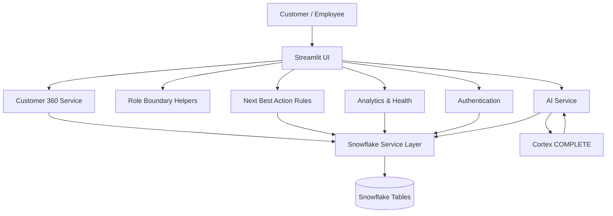

<div align="center">

# 🧠 Customer 360 & Next Best Action Engine

**One workspace for every customer signal — policies, claims, payments, conversations — with AI insights and clear next steps.**


</div>

> 🎯 **Decision support, not decision making.** The platform surfaces evidence-backed recommendations. It never approves claims, changes coverage, or executes actions without human review.

---

## 📑 Contents

[Why this project](#-why-this-project) · [Features](#-features) · [Architecture](#-architecture) · [How AI & NBA work](#-how-ai--nba-work) · [Data model](#-data-model) · [Tech stack](#-tech-stack) · [Quick start](#-quick-start) · [Security](#-security-notes) · [Limitations](#-known-limitations) · [Roadmap](#-roadmap)

---

## 💡 Why this project

Renewals, pending claims, failed payments and repeated support calls live in different places, so important signals get missed. This app unifies them into a single **Customer 360** view and tells teams **who needs attention, why, and what to do next**.

---

## ✨ Features

| | Module | What it does |
|---|---|---|
| 👤 | **Customer 360** | Profile, policies, claims, payments, interactions, and saved AI insights by customer ID, with summary metrics |
| 🤖 | **AI Transcript Insights** | Snowflake Cortex extracts sentiment, intent, topic, churn signal, urgency, confidence and evidence from transcripts |
| 🎯 | **Next Best Action** | Transparent, rule-based recommendations with reason, priority, confidence and evidence |
| 📊 | **Analytics & Risk** | Renewals due, open claims, payment risk, repeat contacts, transcript and insight coverage |
| 🩺 | **System Health** | Table row counts, transcript completeness, AI insight availability |
| 🔐 | **Role-aware access** | Separate Customer and Employee experiences with boundary checks |
| 💬 | **AI Assistant** | Context-aware Q&A, scoped to the signed-in customer's own data |
| 📝 | **Feedback & Action tracking** | Policy feedback view and a hand-off to Action History for employees |

### 🎯 Next Best Action rules

| Trigger | Suggested action | Priority |
|---|---|---|
| Renewal within **30 days** | Schedule renewal follow-up | 🔴 High |
| Payment **overdue / late / failed** | Follow up on payment status | 🔴 High |
| Claim **open or pending** | Review pending claim with customer | 🟡 Medium |
| **3+** interactions recorded | Proactive customer-service follow-up | 🟡 Medium |
| None of the above | No immediate action required | 🟢 Low |

> Rules are configurable business logic, **not** a trained predictive model. Generating a recommendation does not write records, notify anyone, or execute anything.

### 🧾 AI insight output

| Field | Values |
|---|---|
| Sentiment | Positive · Neutral · Negative · UNKNOWN |
| Churn signal | High · Medium · Low · None · UNKNOWN |
| Urgency | High · Medium · Low · UNKNOWN |
| Intent / Topic | Free text |
| Confidence | Normalized 0–1 |
| Evidence | Short quote or grounded explanation |

Handles missing transcripts, Cortex errors, malformed or markdown-fenced JSON, and unexpected values by falling back to `UNKNOWN`.

---

## 🏗️ Architecture



| Layer | Responsibility |
|---|---|
| **Streamlit UI** | Pages, metrics, tables, tabs, filters, forms |
| **Auth + Security helpers** | Email/password/status/role checks; employee and customer boundaries |
| **Snowflake service** | Centralized, parameterized SQL access |
| **Customer 360 service** | Assembles related records and summary metrics |
| **AI service** | Cortex calls, response parsing, summaries, NBA explanations |
| **NBA service** | Rule evaluation over policies, claims, payments, interactions |

---

## 🔄 How AI & NBA work

**Transcript → Insight**

`INTERACTIONS` transcript → empty check → prompt + system instructions → Cortex → JSON parse → normalize → optional upsert into `CUSTOMER_INSIGHTS` → display

**Next Best Action**

Normalize customer ID → load records → evaluate rules → attach reason + evidence → sort by priority → employee reviews → Action History

**Sign-in**

Pick role (`CUSTOMER` / `EMPLOYEE`) → look up `USERS` → check status, role, password → store user in session state

---

## 🗄️ Data model

> Confirm exact columns and constraints against your Snowflake DDL.

| Table / view | Purpose |
|---|---|
| `USERS` | Login identity, role, status, customer link |
| `CUSTOMERS` | Profile and location fields |
| `POLICIES` | Policy type, status, renewal dates |
| `CLAIMS` | Claim records, dates, statuses |
| `PAYMENTS` | Payment history and statuses |
| `INTERACTIONS` | Customer interactions and transcripts |
| `CUSTOMER_INSIGHTS` | Structured AI insights |
| `NEXT_BEST_ACTIONS` | Counted by health dashboard (lifecycle to verify) |
| `ACTION_HISTORY` | Action tracking (schema to verify) |
| `POLICY_FEEDBACK` | Ratings, categories, comments |
| `CUSTOMER_360` | Consolidated view used by the service layer |

Customer IDs are trimmed and uppercased; customer-specific queries are parameterized; health counts use a table allowlist.

---

## 🧰 Tech stack

| Tech | Role |
|---|---|
| Python | App and business logic |
| Streamlit | UI and dashboards |
| Snowflake | Data warehouse |
| Snowflake Cortex (`llama3.1-8b`) | Insights, summaries, explanations |
| Pandas | Filtering, aggregation, summaries |
| SQL | Retrieval and upserts |
| HTML/CSS | Custom dark dashboard theme |

---

## 📁 Project structure

> Inferred from imports; adjust to your repo.

```text
project-root/
├── app.py
├── pages/
│   ├── login.py
│   ├── customer_360.py
│   ├── next_best_action.py
│   ├── analytics.py
│   └── system_health.py
├── services/
│   ├── authentication_service.py
│   ├── snowflake_service.py
│   ├── ai_service.py
│   ├── customer_360_service.py
│   └── next_best_action_service.py
├── utils/
│   └── security.py
├── .streamlit/
│   └── secrets.toml        # local only, never commit
├── requirements.txt
└── README.md
```

---

## 🚀 Quick start

**Prerequisites:** Python 3.10+, a Snowflake account (warehouse, database, schema, role, user) with Cortex access for `llama3.1-8b`.

```bash
# 1. Clone
git clone <https://github.com/ShivamMungbhate/Customer_360>
cd Customer_360

# 2. Virtual environment
python -m venv .venv
source .venv/bin/activate          # Windows: .\.venv\Scripts\Activate.ps1

# 3. Install
pip install -r requirements.txt    # also ensure the Snowflake connector is installed
```

**4. Configure Snowflake** in `.streamlit/secrets.toml`:

```toml
[connections.snowflake]
account   = "YOUR_ACCOUNT_IDENTIFIER"
user      = "YOUR_SNOWFLAKE_USERNAME"
password  = "YOUR_SNOWFLAKE_PASSWORD"   # or use key-pair auth instead
role      = "YOUR_SNOWFLAKE_ROLE"
warehouse = "YOUR_WAREHOUSE"
database  = "YOUR_DATABASE"
schema    = "PUBLIC"
```

**5. Run**

```bash
streamlit run app.py
```

### ✅ Pre-flight checklist

- [ ] Connection is named `snowflake` (`st.connection("snowflake", type="snowflake")`)
- [ ] Role can read all source tables and write to `CUSTOMER_INSIGHTS` / action tables
- [ ] `CUSTOMER_INSIGHTS` exists with expected columns
- [ ] Model is available and Cortex access is enabled
- [ ] Database/schema context matches the service code

---

## 🔒 Security notes

| Area | Action required before production |
|---|---|
| **Passwords** | Demo code compares plaintext with `PASSWORD_HASH`. Replace with proper hashing (bcrypt/argon2) |
| **Authorization** | Validate session state in `enforce_employee_boundary()` / `enforce_customer_boundary()`; prevent customer-ID tampering |
| **Errors** | Don't show raw exceptions to users; log securely |
| **Snowflake roles** | Least privilege; separate read and write |
| **Secrets** | Git-ignore `secrets.toml`, `.env`, private keys |
| **Data** | Use synthetic or masked data in demos |
| **AI** | Treat transcripts as untrusted; validate output; never let generated text authorize actions |
| **Audit** | Log who, when, evidence, and status for sensitive actions |
| **Privacy** | Review retention rules for transcripts and profiles |

---

## ⚠️ Known limitations

1. **Demo-grade auth:** plaintext password comparison.
2. **Boundary helpers** need full review.
3. **Health metrics can mislead:** a failed count query returns `0`, so it looks like an empty table.
4. **Cortex JSON isn't guaranteed:** failures are handled, but need logging and a retry policy.
5. **Confidence is model-reported,** not a calibrated probability.
6. **NBA priorities and confidence are fixed constants,** not learned.
7. **Per-customer repeated queries** won't scale; prefer joins, views, or batching.
8. **Timezone policy** for renewal rules is undefined.
9. **Schema and lifecycle** of insights, NBA, action history, feedback need DDL verification.
10. **Production readiness not established:** no tests, CI/CD, monitoring, or migrations verified.

---

## 🗺️ Roadmap

- [ ] Secure password hashing and provisioning
- [ ] Tests for auth, role boundaries, data access, NBA rules
- [ ] Separate "query failed" from "0 records" in health metrics
- [ ] Structured logging for Cortex failures and invalid outputs
- [ ] Schema setup / migration scripts and documented grants
- [ ] Batched analytics queries
- [ ] Auditable action lifecycle with statuses, actor, timestamps
- [ ] Evaluation dataset for transcript insights
- [ ] Deployment guide for the chosen hosting model
- [ ] Screenshots and demo walkthrough

---

